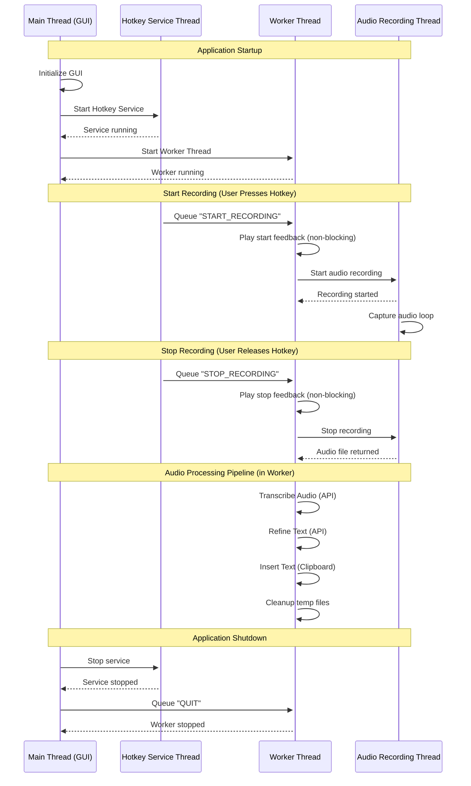

<p align="center">
  
</p>


# PushToTalk - AI Refined Speech-to-Text Dictation


[](https://codecov.io/gh/yixin0829/push-to-talk)


A Python application that provides push-to-talk speech-to-text functionality with AI speech to text transcription, smart text refinement, and automatic text insertion into the active window on Windows, MacOS (coming soon), and Linux (coming soon). **Now features a persistent GUI configuration interface with real-time status management and easy application control.**

## 🏆 Why PushToTalk?

**Compared to Wispr Flow ($14.40/month) and Superwhisper ($8.49/month), PushToTalk delivers:**

| Feature | PushToTalk | Others |
|---------|-----------|--------|
| **Cost** | **FREE** + pay-as-you-go API | $102-216/year subscription |
| **STT Speed** | **Ultra-fast** (Deepgram Nova-3 and Cerebras) | Standard latency |
| **Customization** | Multi-provider choice, custom glossary, custom prompts | Limited vendor lock-in |
| **Privacy** | Full inference provider control, choose your API including Ollama | Proprietary ecosystem |

**For power users, developers, and privacy-conscious teams: PushToTalk is the most customizable, fastest, and nearly free alternative to existing AI dictation tools.**

## Features

- **🎯 GUI Interface**: Integrated configuration control and application status monitoring in one window
- **🔄 Live Config Sync**: GUI edits instantly push updates to the running background service—no restart required
- **📚 Custom Glossary**: Add domain-specific terms and acronyms to improve transcription accuracy
- **✨ Multi-Provider Text Refinement**: Improves transcription quality using OpenAI GPT or Cerebras models
- **🤖 Multi-Provider Speech-to-Text**: Choose between OpenAI Whisper or Deepgram for accurate transcription
- **🎤 Push-to-Talk Recording**: Hold a customizable hotkey to record audio (platform-aware defaults)
- **📝 Auto Text Insertion**: Automatically inserts refined text into the active window

## Demos
- v0.5.0: https://app.canvid.com/share/fi_01KDGEDBA86537CP18E9XDDJY8
- v0.3.0 - v0.4.0: https://www.loom.com/share/71ecc05d4bb440ecb708d980505b9000
- v0.2.0: https://www.loom.com/share/fbabb2da83c249d3a0a09b3adcc4a4e6

## Roadmap
See [issues](https://github.com/yixin0829/push-to-talk/issues) for more details.

## Requirements

- [uv](https://docs.astral.sh/uv/) (Python package manager)
- **At least one STT API key**:
  - OpenAI Whisper: https://platform.openai.com/docs/api-reference/introduction
  - Deepgram: https://deepgram.com/
- **Text refinement (optional)**:
  - OpenAI GPT: https://platform.openai.com/docs/api-reference/introduction
  - Cerebras: https://cerebras.ai/
- Microphone access (for recording)

## Quick Start (GUI Application)

### For End Users (Recommended)

1. **Download and launch**:
   - Download `PushToTalk.exe` from releases
   - Double-click to launch the configuration interface

2. **One-window setup and control**:
   - **Welcome section** explains the application at the top
   - **Configure your settings** in the organized sections below
   - **Click "Start Application"** to begin - the GUI stays open
   - **Monitor status** with real-time indicators (green = running, gray = stopped)
   - **View active settings** displayed when running
   - **Easy control** with "Stop Application" button to terminate
   - **Tweak settings live**—changes made while running apply instantly

3. **Daily usage**:
   - GUI provides persistent control and status monitoring
   - Use your configured hotkeys to record and transcribe
   - Tune preferences without stopping the service; hotkeys update in real time
   - Start/stop the service anytime from the GUI

### For Developers

1. **Clone the repository**:
   ```bash
   git clone <repository-url>
   cd push-to-talk
   ```

2. **Install dependencies**:
   ```bash
   uv sync
   ```

3. **Run the GUI application**:
   ```bash
   uv run python main.py           # Normal mode (logs to file only)
   uv run python main.py --debug   # Debug mode (logs to console and file)
   ```

   The `--debug` flag enables console logging for real-time debugging and troubleshooting.

## GUI Configuration Interface

The application features a comprehensive, persistent configuration GUI with organized sections:

### Welcome & Status
- **Real-Time Status**: Visual indicators show current application state
  - **Gray circle + "Ready to start"**: Application stopped
  - **Green circle + "Running - Use your configured hotkeys"**: Application running
- **Active Settings Display**: Shows current hotkeys and enabled features when running
- **Live Updates Banner**: Status automatically refreshes when settings change mid-session

### Live Configuration Updates

The application features a sophisticated real-time configuration system that applies changes instantly while running:

#### How It Works
- **Variable Tracing**: Every GUI field (text boxes, checkboxes, dropdowns) automatically detects changes using Tkinter variable traces
- **Smart Debouncing**: Rapid typing is intelligently handled with configurable delay to prevent excessive updates
- **Selective Reinitialization**: Only components affected by changes are reinitialized (e.g., hotkey changes → restart hotkey service)
- **Service Continuity**: Critical services like hotkey detection automatically restart after updates

#### Technical Features
- **Instant Propagation**: Editing any field triggers a debounced update to the running PushToTalk service
- **Persistent Storage**: Changes are automatically saved to JSON file asynchronously for permanent persistence
- **Callback Support**: Optional listeners receive validated Pydantic configuration models whenever values change
- **Glossary Sync**: Glossary edits are copied before rebuilds to prevent UI/model divergence
- **Safe Programmatic Updates**: GUI refreshes suspend traces to avoid infinite callback loops
- **Thread-Safe Saves**: Non-blocking background saves with deduplication prevent file conflicts

#### Example Scenarios
- **Hotkey Change**: Type "ctrl+alt+space" → Only final result triggers one hotkey service restart
- **Non-Critical Change**: Toggle "Audio Feedback" → Updates instantly without restarting core components
- **API Key Change**: Update OpenAI key → Only transcription/refinement components reinitialize

### Speech-to-Text Settings
- **STT Provider Selection**: Choose between OpenAI or Deepgram (default: Deepgram)
- **API Key**: Secure entry with show/hide functionality (dynamically shows OpenAI or Deepgram field based on provider)
- **Model Selection**: Choose provider-specific models:
  - **OpenAI**: whisper-1, gpt-4o-transcribe, gpt-4o-mini-transcribe
  - **Deepgram**: nova-3 (default and recommended), nova-2, base, enhanced, whisper-medium

### Text Refinement Settings
- **Refinement Provider**: Choose between OpenAI or Cerebras (default: Cerebras)
- **Refinement Model**: Provider-specific models:
  - **OpenAI**: gpt-4.1-nano, gpt-4o-mini, gpt-4o
  - **Cerebras**: llama-3.3-70b (default), llama-3.1-70b, and other Cerebras models

### Audio Settings
- **Sample Rate**: 8kHz to 44.1kHz options (16kHz recommended)
- **Chunk Size**: Buffer size configuration
- **Channels**: Mono/stereo recording options
- **Helpful Recommendations**: Built-in guidance for optimal settings

### Hotkey Configuration
- **Push-to-Talk Hotkey**: Hold to record (default: Ctrl+Shift+^ on Windows/Linux, Cmd+Shift+Space on macOS)
- **Toggle Recording Hotkey**: Press once to start/stop (default: Ctrl+Shift+Space on Windows/Linux, Cmd+Shift+^ on macOS)
- **Record Button**: Click "Record" and press keys one at a time to capture hotkey combinations
- **Validation**: Prevents duplicate hotkey assignments and ensures hotkeys are different

### Custom Glossary
- **Domain-Specific Terms**: Add specialized vocabulary, acronyms, and proper names
- **Easy Management**: Add, edit, and delete glossary terms through the GUI
- **Search Functionality**: Quickly find and manage existing terms
- **Automatic Integration**: Glossary terms are automatically included in transcription refinement

### Custom Refinement Prompt
- **Customizable System Prompt**: Create your own text refinement instructions
- **Glossary Placeholder**: Use `{custom_glossary}` placeholder to include glossary terms in your prompt
- **Copy Default Buttons**: Start from default prompts (with or without glossary) as templates
- **Reference Section**: View default prompts in collapsible reference panel
- **Live Updates**: Changes apply immediately to running application


## How to Use

1. **Build**: Build the application using `build.bat` if first time running on Windows
2. **Launch**: Double-click the built `PushToTalk.exe` or run `uv run python main.py`
3. **Configure**: Use the integrated setup interface with welcome guidance
4. **Start**: Click "Start Application" - GUI stays open with status indicators
5. **Monitor**: Watch real-time status and active settings display
6. **Use**: Background operation with your configured hotkeys
7. **Control**: Use "Stop Application" button to terminate, or restart anytime

## Building the Application

```bash
.\build.bat
```
This creates `dist\PushToTalk.exe` - a standalone GUI application.


## Configuration

The application supports both GUI and file-based configuration with automatic environment variable fallback:

### API Key Management
The application supports three ways to provide API keys (checked in this order):
1. **GUI**: Enter API keys directly in the configuration interface (stored in `push_to_talk_config.json`)
2. **Environment Variables**: Set `OPENAI_API_KEY`, `DEEPGRAM_API_KEY`, or `CEREBRAS_API_KEY`
3. **Configuration File**: Manually edit `push_to_talk_config.json`

The required API key depends on your selected providers:
- **STT Provider**: OpenAI requires `openai_api_key`, Deepgram requires `deepgram_api_key`
- **Refinement Provider**: OpenAI requires `openai_api_key`, Cerebras requires `cerebras_api_key`

Environment variables are checked automatically if GUI or config file values are empty.

### Via GUI (Recommended)
- Launch the application to access the integrated configuration interface
- **All settings** validated and saved automatically to `push_to_talk_config.json`
- **Real-time status** shows application state with visual indicators
- **Auto-sync**: Edits instantly update the running background service and any registered callbacks
- API keys are validated on startup; application will show clear error messages if required keys are missing

### File-Based Configuration
The application creates a `push_to_talk_config.json` file. Example configuration file:

```json
{
  "stt_provider": "deepgram",
  "openai_api_key": "",
  "deepgram_api_key": "your_deepgram_key",
  "stt_model": "nova-3",
  "refinement_provider": "cerebras",
  "refinement_model": "llama-3.3-70b",
  "cerebras_api_key": "your_cerebras_key",
  "sample_rate": 16000,
  "chunk_size": 1024,
  "channels": 1,
  "hotkey": "ctrl+shift+^",
  "toggle_hotkey": "ctrl+shift+space",
  "enable_text_refinement": true,
  "enable_logging": true,
  "enable_audio_feedback": true,
  "debug_mode": false,
  "custom_glossary": ["API", "OAuth", "microservices", "PostgreSQL"],
  "custom_refinement_prompt": ""
}
```

#### Configuration Parameters

| Parameter | Type | Default | Description |
|-----------|------|---------|-------------|
| `stt_provider` | string | `"deepgram"` | Speech-to-text provider. Options: `openai`, `deepgram`. Determines which transcription service to use. |
| `openai_api_key` | string | `""` | Your OpenAI API key for Whisper services. Required when using OpenAI provider. Can be set via GUI, config file, or `OPENAI_API_KEY` environment variable. |
| `deepgram_api_key` | string | `""` | Your Deepgram API key for transcription services. Required when using Deepgram provider. Can be set via GUI, config file, or `DEEPGRAM_API_KEY` environment variable. |
| `stt_model` | string | `"nova-3"` | STT Model for speech-to-text. For OpenAI: `whisper-1`, `gpt-4o-transcribe`, `gpt-4o-mini-transcribe`. For Deepgram: `nova-3`, `nova-2`, `base`, `enhanced`, `whisper-medium`. |
| `refinement_provider` | string | `"cerebras"` | Text refinement provider. Options: `openai`, `cerebras`. Determines which AI service refines transcribed text. |
| `refinement_model` | string | `"llama-3.3-70b"` | Refinement Model for text refinement. For OpenAI: `gpt-4.1-nano`, `gpt-4o-mini`, `gpt-4o`. For Cerebras: `llama-3.3-70b`, `llama-3.1-70b`, and other Cerebras-supported models. |
| `cerebras_api_key` | string | `""` | Your Cerebras API key for text refinement. Required when using Cerebras provider. Can be set via GUI, config file, or `CEREBRAS_API_KEY` environment variable. |
| `sample_rate` | integer | `16000` | Audio sampling frequency in Hz. 16kHz is optimal for speech recognition. |
| `chunk_size` | integer | `1024` | Audio buffer size in samples. Determines how much audio is read at once (affects latency vs performance). |
| `channels` | integer | `1` | Number of audio channels. Use `1` for mono recording (recommended for speech). |
| `hotkey` | string | `"ctrl+shift+^"` | Hotkey combination for push-to-talk. Platform-aware defaults: Windows/Linux `ctrl+shift+^`, macOS `cmd+shift+space`. See [Hotkey Options](#hotkey-options) for examples. |
| `toggle_hotkey` | string | `"ctrl+shift+space"` | Hotkey combination for toggle recording mode. Press once to start, press again to stop. Platform-aware defaults: Windows/Linux `ctrl+shift+space`, macOS `cmd+shift+^`. |
| `enable_text_refinement` | boolean | `true` | Whether to refine transcribed text using AI. Disable for faster processing without refinement. |
| `enable_logging` | boolean | `true` | Whether to enable detailed logging to `push_to_talk.log` file using loguru. |
| `enable_audio_feedback` | boolean | `true` | Whether to play audio cues when starting/stopping recording. Provides immediate feedback for hotkey interactions. |
| `debug_mode` | boolean | `false` | Whether to enable debug mode. When enabled, recorded audio files are saved to timestamped debug directories (e.g., `debug_audio_20231215_143022_456/`) with recording metadata for troubleshooting. |
| `custom_glossary` | array | `[]` | List of domain-specific terms, acronyms, and proper names to improve transcription accuracy. Terms are automatically included in text refinement prompts. |
| `custom_refinement_prompt` | string | `""` | Custom system prompt for text refinement. Leave empty to use default prompts. Use `{custom_glossary}` placeholder to include glossary terms dynamically. |

#### Audio Quality Settings

- **sample_rate**:
  - `16000` (16kHz) - Recommended for speech (Whisper optimized)
  - `8000` (8kHz) - Lower quality but faster processing
  - `44100` (44.1kHz) - CD quality (overkill for speech, slower)

- **chunk_size**:
  - `512` - Lower latency, more CPU overhead
  - `1024` - Balanced (recommended)
  - `2048` - Higher latency, less CPU usage

- **channels**:
  - `1` - Mono recording (recommended for speech)
  - `2` - Stereo recording (unnecessary for speech-to-text)

### Hotkey Options

You can configure different hotkey combinations for both modes. Platform-specific defaults ensure compatibility:

**Push-to-talk hotkey** (hold to record):
- Windows/Linux: `ctrl+shift+^` (default), `ctrl+alt+r`, `f12`
- macOS: `cmd+shift+space` (default), `cmd+alt+r`, `f12`

**Toggle hotkey** (press once to start, press again to stop):
- Windows/Linux: `ctrl+shift+space` (default), `ctrl+shift+t`
- macOS: `cmd+shift+^` (default), `cmd+shift+t`

Both hotkeys support any combination from the `keyboard` library. The application automatically uses platform-aware defaults based on your OS.

### Custom Glossary

The application supports custom glossary terms to improve transcription accuracy for domain-specific vocabulary:

- **Add Terms**: Use the GUI to add specialized vocabulary, acronyms, and proper names
- **Automatic Integration**: Glossary terms are automatically included in text refinement prompts
- **Smart Processing**: TextRefiner switches between prompts with and without glossary automatically
- **Persistent Storage**: Terms are saved in the configuration file and restored on startup
- **Easy Management**: Add, edit, delete, and search glossary terms through the GUI interface

**Example use cases**:
- Technical terms: "API", "OAuth", "microservices", "PostgreSQL"
- Company names: "Anthropic", "OpenAI"
- Acronyms: "CEO", "CTO", "AI/ML", "SaaS"
- Domain-specific vocabulary: Medical terms, legal terminology, etc.

### Audio Feedback

The application includes clean and simple audio feedback:

- **Recording Start**: A crisp high-pitched beep (880 Hz) that signals recording has begun
- **Recording Stop**: A lower confirmation beep (660 Hz) that confirms recording completion
- **Non-Blocking**: Audio playback runs in separate threads to avoid interfering with recording or transcription
- **Configurable**: Can be toggled on/off via GUI or configuration JSON file
- **Cross-Platform**: Uses `playsound3` for audio playback - works on Windows, MacOS, and Linux

## Architecture



### Threading Model

The application uses separate threads for responsiveness:

- **Main Thread**: GUI and configuration
- **Hotkey Service**: Global keyboard detection (producer) → queues commands
- **Worker Thread**: Audio processing pipeline (consumer) → transcribe → refine → insert text
- **Audio Recording**: Real-time PyAudio buffering
- **Daemon Threads**: Non-blocking API calls

**Key Design**: Hotkeys are detected instantly even during API calls because the hotkey service operates independently from the worker thread. Commands queue and process sequentially, preventing race conditions.

See [AGENTS.md](AGENTS.md) for detailed threading implementation.

## Troubleshooting

### GUI Application Issues

1. **Application won't start**:
   - Make sure you're running as Administrator for hotkey detection
   - Check that the executable isn't blocked by antivirus
   - Try running from command line to see error messages

2. **Status indicators not updating**:
   - The GUI should show real-time status changes when starting/stopping
   - If stuck, try restarting the application
   - Check `push_to_talk.log` for error details

3. **Start/Stop button not working**:
   - Ensure all required fields are filled (API keys based on selected providers)
   - For Deepgram STT: Need `deepgram_api_key`
   - For OpenAI STT: Need `openai_api_key`
   - For Cerebras refinement: Need `cerebras_api_key`
   - For OpenAI refinement: Need `openai_api_key`
   - Use "Test Configuration" to validate settings
   - Check that no other instance is running

4. **Settings not saving**:
   - Ensure the application has write permissions in its directory
   - Check that the configuration file isn't marked as read-only
   - Try running as Administrator

### Common Issues

1. **"No module named 'pyautogui' or 'pyperclip'"** (Development):
   ```bash
   uv add pyautogui pyperclip
   ```

2. **"Could not find PyAudio"** (Development):
   - Install PyAudio: `uv add pyaudio`
   - On Windows, you may need Visual C++ build tools

3. **Hotkey not working**:
   - Run as administrator (required for global hotkey detection)
   - Check if another application is using the same hotkey
   - Try a different hotkey combination in the GUI
   - Ensure the application shows "Running" status in the GUI

4. **API errors or missing credentials**:
   - Use the "Test Configuration" button in the GUI to validate settings
   - Verify your API keys are valid and have sufficient credits/usage quota
   - Check that your accounts have access to the models you're using
   - For Deepgram: Verify Deepgram API key and subscription plan
   - For Cerebras: Verify Cerebras API key and account status
   - Ensure internet connectivity
   - Check `push_to_talk.log` for specific API error messages

5. **Text not inserting**:
   - Make sure the target window is active and has a text input field
   - Check Windows permissions for clipboard access

6. **GUI appearance issues**:
   - Try restarting the application
   - Check display scaling settings (recommended: 100-150%)
   - Ensure Windows is up to date

### Logging

Logs are written to `push_to_talk.log` using loguru's enhanced formatting. The GUI application logs only to file for cleaner user experience.


## Performance Tips

1. **Optimize audio settings**: Lower sample rates (8000-16000 Hz) for faster processing
2. **Enable audio processing**: Smart silence removal and speed adjustment can significantly reduce transcription time
3. **Disable text refinement**: For faster transcription without GPT processing
4. **Short recordings**: Keep recordings under 30 seconds for optimal performance
5. **Monitor via GUI**: Use the status indicators to verify application is running efficiently

## Security Considerations

- **API Key Security**: GUI stores API keys securely; avoid sharing configuration files
- **Administrator Rights**: Required for global hotkey detection
- **Microphone Access**: Application needs microphone permissions
- **Network Access**: Required for OpenAI API calls
- **File Permissions**: Ensure configuration files have appropriate access controls

## Testing

For comprehensive testing information, see [CONTRIBUTING.md](CONTRIBUTING.md#testing).

**Quick Start:**
```bash
uv run pytest tests/ -v                       # All tests
uv run pytest tests/ --cov=src --cov-report=html # With coverage
```
