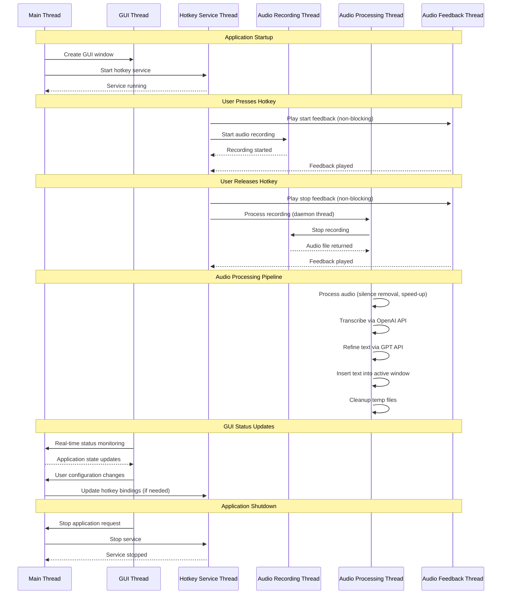
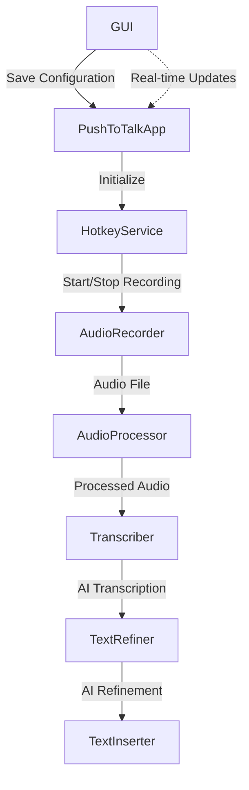

<p align="center">
  
</p>


# PushToTalk - AI Refined Speech-to-Text Dictation
[](https://codecov.io/gh/yixin0829/push-to-talk)

A Python application that provides push-to-talk speech-to-text functionality with AI speech to text transcription, smart text refinement, and automatic text insertion into the active window on Windows, MacOS (to be built), and Linux (to be built). **Now features a persistent GUI configuration interface with real-time status management and easy application control.**

## Features

- **🎯 GUI Interface**: Integrated configuration control and application status monitoring in one window
- **🔄 Live Config Sync**: GUI edits instantly push updates to the running background service—no restart required
- **📚 Custom Glossary**: Add domain-specific terms and acronyms to improve transcription accuracy
- **✨ Text Refinement**: Improves transcription quality using Refinement Models
- **🤖 Speech-to-Text**: Uses OpenAI transcription service for accurate transcription
- **🎤 Push-to-Talk Recording**: Hold a customizable hotkey to record audio
- **⚡ Smart Audio Processing**: Automatic silence removal and pitch-preserving speed adjustment for faster transcription
- **📝 Auto Text Insertion**: Automatically inserts refined text into the active window

## Demos
- v0.3.0 - v0.4.0: https://www.loom.com/share/71ecc05d4bb440ecb708d980505b9000
- v0.2.0: https://www.loom.com/share/fbabb2da83c249d3a0a09b3adcc4a4e6

## Roadmap
See [issues](https://github.com/yixin0829/push-to-talk/issues) for more details.

## Requirements

- [uv](https://docs.astral.sh/uv/) (Python package manager)
- OpenAI API key (https://platform.openai.com/docs/api-reference/introduction)
- Microphone access (for recording)

## Quick Start (GUI Application)

### For End Users (Recommended)

1. **Download and launch**:
   - Download `PushToTalk.exe` from releases
   - Double-click to launch the configuration interface

2. **One-window setup and control**:
   - **Welcome section** explains the application at the top
   - **Configure your settings** in the organized sections below
   - **Click "Start Application"** to begin - the GUI stays open
   - **Monitor status** with real-time indicators (green = running, gray = stopped)
   - **View active settings** displayed when running
   - **Easy control** with "Stop Application" button to terminate
   - **Tweak settings live**—changes made while running apply instantly

3. **Daily usage**:
   - GUI provides persistent control and status monitoring
   - Use your configured hotkeys to record and transcribe
   - Tune preferences without stopping the service; hotkeys update in real time
   - Start/stop the service anytime from the GUI

### For Developers

1. **Clone the repository**:
   ```bash
   git clone <repository-url>
   cd push-to-talk
   ```

2. **Install dependencies**:
   ```bash
   uv sync
   ```

3. **Run the GUI application**:
   ```bash
   uv run python main.py
   ```

## GUI Configuration Interface

The application features a comprehensive, persistent configuration GUI with organized sections:

### Welcome & Status
- **Real-Time Status**: Visual indicators show current application state
  - **Gray circle + "Ready to start"**: Application stopped
  - **Green circle + "Running - Use your configured hotkeys"**: Application running
- **Active Settings Display**: Shows current hotkeys and enabled features when running
- **Live Updates Banner**: Status automatically refreshes when settings change mid-session

### Live Configuration Updates
- **Instant Propagation**: Editing any field triggers a debounced update to the running PushToTalk service
- **Callback Support**: Optional listeners receive configuration dataclasses whenever values change
- **Glossary Sync**: Glossary edits are copied before rebuilds to prevent UI/model divergence
- **Safe Programmatic Updates**: GUI refreshes suspend traces to avoid infinite callback loops

### API Settings
- **OpenAI API Key**: Secure entry with show/hide functionality
- **Model Selection**: Choose Whisper and Refinement Models
- **API Key Testing**: Validate your credentials

### Audio Settings
- **Sample Rate**: 8kHz to 44.1kHz options (16kHz recommended)
- **Chunk Size**: Buffer size configuration
- **Channels**: Mono/stereo recording options
- **Audio Processing**: Smart silence removal and pitch-preserving speed adjustment
- **Helpful Recommendations**: Built-in guidance for optimal settings

### Hotkey Configuration
- **Push-to-Talk Hotkey**: Hold to record (default: Ctrl+Shift+Space)
- **Toggle Recording Hotkey**: Press once to start/stop (default: Ctrl+Shift+^)
- **Validation**: Prevents duplicate hotkey assignments
- **Examples**: Common hotkey combinations provided

### Text Insertion Settings
- **Insertion Method**: Choose between clipboard (fast) or sendkeys (compatible)
- **Insertion Delay**: Fine-tune timing for different applications
- **Method Guidance**: Recommendations for each approach

### Custom Glossary
- **Domain-Specific Terms**: Add specialized vocabulary, acronyms, and proper names
- **Easy Management**: Add, edit, and delete glossary terms through the GUI
- **Search Functionality**: Quickly find and manage existing terms
- **Automatic Integration**: Glossary terms are automatically included in transcription refinement


## How to Use

1. **Build**: Build the application using `build.bat` if first time running on Windows
2. **Launch**: Double-click the built `PushToTalk.exe` or run `uv run python main.py`
3. **Configure**: Use the integrated setup interface with welcome guidance
4. **Start**: Click "Start Application" - GUI stays open with status indicators
5. **Monitor**: Watch real-time status and active settings display
6. **Use**: Background operation with your configured hotkeys
7. **Control**: Use "Stop Application" button to terminate, or restart anytime

## Building the Application

```bash
.\build.bat
```
This creates `dist\PushToTalk.exe` - a standalone GUI application.


## Configuration

The application supports both GUI and file-based configuration:

### Via GUI (Recommended)
- Launch the application to access the integrated configuration interface
- **All settings** validated and saved automatically to `push_to_talk_config.json`
- **Real-time status** shows application state with visual indicators
- **Auto-sync**: Edits instantly update the running background service and any registered callbacks
- Every time you start the application, your configuration is saved and overwrites the old configuration in the JSON file `push_to_talk_config.json`

### File-Based Configuration
The application creates a `push_to_talk_config.json` file. Example configuration file:

```json
{
  "openai_api_key": "your_api_key_here",
  "stt_model": "gpt-4o-transcribe",
  "refinement_model": "gpt-4.1-nano",
  "sample_rate": 16000,
  "chunk_size": 1024,
  "channels": 1,
  "hotkey": "ctrl+shift+space",
  "toggle_hotkey": "ctrl+shift+^",
  "insertion_method": "sendkeys",
  "insertion_delay": 0.005,
  "enable_text_refinement": true,
  "enable_logging": true,
  "enable_audio_feedback": true,
  "enable_audio_processing": true,
  "debug_mode": false,
  "silence_threshold": -16.0,
  "min_silence_duration": 400.0,
  "speed_factor": 1.5,
  "custom_glossary": ["API", "OAuth", "microservices", "PostgreSQL"]
}
```

#### Configuration Parameters

| Parameter | Type | Default | Description |
|-----------|------|---------|-------------|
| `openai_api_key` | string | `""` | Your OpenAI API key for Whisper and GPT services. Required for transcription and text refinement. Can be set via GUI, config file, or `OPENAI_API_KEY` environment variable. |
| `stt_model` | string | `"gpt-4o-transcribe"` | STT Model for speech-to-text. Options: `gpt-4o-transcribe`, `whisper-1`. |
| `refinement_model` | string | `"gpt-4.1-nano"` | Refinement Model for text refinement. Options: `gpt-4.1-nano`, `gpt-4o-mini`, `gpt-4o`. |
| `sample_rate` | integer | `16000` | Audio sampling frequency in Hz. 16kHz is optimal for speech recognition with Whisper. |
| `chunk_size` | integer | `1024` | Audio buffer size in samples. Determines how much audio is read at once (affects latency vs performance). |
| `channels` | integer | `1` | Number of audio channels. Use `1` for mono recording (recommended for speech). |
| `hotkey` | string | `"ctrl+shift+space"` | Hotkey combination for push-to-talk. See [Hotkey Options](#hotkey-options) for examples. |
| `toggle_hotkey` | string | `"ctrl+shift+^"` | Hotkey combination for toggle recording mode. Press once to start, press again to stop. |
| `insertion_method` | string | `"sendkeys"` | Method for inserting text. Options: `sendkeys` (better for special chars), `clipboard` (faster). |
| `insertion_delay` | float | `0.005` | Delay in seconds before text insertion. Helps ensure target window is ready. |
| `enable_text_refinement` | boolean | `true` | Whether to use GPT to refine transcribed text. Disable for faster processing without refinement. |
| `enable_logging` | boolean | `true` | Whether to enable detailed logging to `push_to_talk.log` file using loguru. |
| `enable_audio_feedback` | boolean | `true` | Whether to play sophisticated audio cues when starting/stopping recording. Provides immediate feedback for hotkey interactions. |
| `enable_audio_processing` | boolean | `true` | Whether to enable smart audio processing (silence removal and speed adjustment) for faster transcription. |
| `debug_mode` | boolean | `false` | Whether to enable debug mode. If enabled, processed audio files will be saved to the current directory. |
| `silence_threshold` | float | `-16.0` | dBFS threshold for silence detection. Higher values (closer to 0) are more sensitive to quiet sounds. |
| `min_silence_duration` | float | `400.0` | Minimum duration of silence in milliseconds required to split audio segments. |
| `speed_factor` | float | `1.5` | Speed adjustment factor. 1.5 means 1.5x faster playback while preserving pitch quality. |
| `custom_glossary` | array | `[]` | List of domain-specific terms, acronyms, and proper names to improve transcription accuracy. Terms are automatically included in text refinement prompts. |

#### Audio Quality Settings

- **sample_rate**:
  - `16000` (16kHz) - Recommended for speech (Whisper optimized)
  - `8000` (8kHz) - Lower quality but faster processing
  - `44100` (44.1kHz) - CD quality (overkill for speech, slower)

- **chunk_size**:
  - `512` - Lower latency, more CPU overhead
  - `1024` - Balanced (recommended)
  - `2048` - Higher latency, less CPU usage

- **channels**:
  - `1` - Mono recording (recommended for speech)
  - `2` - Stereo recording (unnecessary for speech-to-text)

#### Audio Processing Settings

- **silence_threshold**:
  - `-16.0` (dBFS) - Recommended balance between noise removal and speech preservation
  - `-10.0` - More aggressive silence removal (may cut quiet speech)
  - `-30.0` - Less aggressive (keeps more background noise)

- **min_silence_duration**:
  - `400.0` ms - Recommended for natural speech patterns
  - `200.0` ms - More aggressive silence removal (faster processing)
  - `800.0` ms - Conservative (preserves natural pauses)

- **speed_factor**:
  - `1.5` - Recommended 1.5x speedup with pitch preservation
  - `1.0` - No speed adjustment (original timing)
  - `2.0` - 2x speedup (more aggressive, may affect quality)

### Hotkey Options

You can configure different hotkey combinations for both modes:

**Push-to-talk hotkey** (hold to record):
- `ctrl+shift+space` (default)
- `ctrl+alt+r`
- `f12`

**Toggle hotkey** (press once to start, press again to stop):
- `ctrl+shift+^` (default)
- `ctrl+shift+t`

Both hotkeys support any combination from the `keyboard` library.

### Text Insertion Methods

- **sendkeys** (default): Simulates individual keystrokes using pyautogui, better for special characters
- **clipboard**: Faster and more reliable, uses pyperclip and pyautogui for Ctrl+V

### Custom Glossary

The application supports custom glossary terms to improve transcription accuracy for domain-specific vocabulary:

- **Add Terms**: Use the GUI to add specialized vocabulary, acronyms, and proper names
- **Automatic Integration**: Glossary terms are automatically included in text refinement prompts
- **Smart Processing**: TextRefiner switches between prompts with and without glossary automatically
- **Persistent Storage**: Terms are saved in the configuration file and restored on startup
- **Easy Management**: Add, edit, delete, and search glossary terms through the GUI interface

**Example use cases**:
- Technical terms: "API", "OAuth", "microservices", "PostgreSQL"
- Company names: "Anthropic", "OpenAI"
- Acronyms: "CEO", "CTO", "AI/ML", "SaaS"
- Domain-specific vocabulary: Medical terms, legal terminology, etc.

### Audio Feedback

The application includes clean and simple audio feedback:

- **Recording Start**: A crisp high-pitched beep (880 Hz) that signals recording has begun
- **Recording Stop**: A lower confirmation beep (660 Hz) that confirms recording completion
- **Non-Blocking**: Audio playback runs in separate threads to avoid interfering with recording or transcription
- **Configurable**: Can be toggled on/off via GUI or configuration JSON file
- **Cross-Platform**: Uses `playsound3` for audio playback - works on Windows, MacOS, and Linux

## Architecture

The application consists of several modular components:

### Core Components

- **ConfigurationGUI** (`src/config_gui.py`): User-friendly GUI for settings management
- **MainGUI** (`main.py`): Entry point with welcome flow and startup management
- **AudioRecorder** (`src/audio_recorder.py`): Handles audio recording using PyAudio
- **AudioProcessor** (`src/audio_processor.py`): Smart audio processing with silence removal and pitch-preserving speed adjustment using pydub and psola
- **Transcriber** (`src/transcription.py`): Converts speech to text using OpenAI Whisper
- **TextRefiner** (`src/text_refiner.py`): Improves transcription using Refinement Models with custom glossary support
- **TextInserter** (`src/text_inserter.py`): Inserts text into active windows using pyautogui and pyperclip
- **HotkeyService** (`src/hotkey_service.py`): Manages global hotkey detection
- **PushToTalkApp** (`src/push_to_talk.py`): Main application orchestrator with dynamic configuration updates

### User Experience Flow

1. **Launch** → Single window with integrated welcome and configuration
2. **Configure** → Comprehensive GUI with organized settings sections
3. **Start** → Click "Start Application" with immediate visual feedback
4. **Monitor** → Real-time status indicators and active settings display
5. **Operate** → Background push-to-talk with persistent GUI control
6. **Control** → Easy start/stop with "Stop Application" button
7. **Manage** → Multiple start/stop cycles without closing the interface

### Threading Architecture

The application uses multiple threads to ensure responsive operation and prevent blocking of the main GUI thread:



**Key Threading Features:**
- **Non-blocking Operation**: Audio processing runs in daemon threads to avoid blocking hotkey detection
- **Parallel Audio Feedback**: Start/stop feedback sounds play in separate threads for immediate response
- **Thread-safe Processing**: Uses `threading.Lock()` to prevent concurrent audio processing operations
- **Daemon Threads**: Processing threads are marked as daemon to prevent hanging on application exit
- **GUI Responsiveness**: Main GUI thread remains responsive during audio processing operations

### Data Flow



1. User presses hotkey → Audio recording starts
2. User releases hotkey → Recording stops
3. Audio file is processed (silence removal and speed adjustment for faster transcription)
4. Processed audio is sent to OpenAI Whisper for transcription
5. Raw transcription is refined using Refinement Models (if enabled)
6. Refined text is inserted into the active window

## Dependencies

- **tkinter**: GUI interface (built into Python)
- **keyboard**: Global hotkey detection
- **loguru**: Enhanced logging with better formatting and features
- **pyaudio**: Audio recording
- **pydub**: Smart silence detection and audio manipulation
- **soundfile**: High-quality audio I/O
- **psola**: Pitch-preserving time-scale modification
- **openai**: Speech-to-text and text refinement
- **pyautogui**: Cross-platform text insertion and window management
- **pyperclip**: Cross-platform clipboard operations
- **playsound3**: Cross-platform audio feedback (lightweight alternative to pygame)

## Troubleshooting

### GUI Application Issues

1. **Application won't start**:
   - Make sure you're running as Administrator for hotkey detection
   - Check that the executable isn't blocked by antivirus
   - Try running from command line to see error messages

2. **Status indicators not updating**:
   - The GUI should show real-time status changes when starting/stopping
   - If stuck, try restarting the application
   - Check `push_to_talk.log` for error details

3. **Start/Stop button not working**:
   - Ensure all required fields are filled (especially OpenAI API key)
   - Use "Test Configuration" to validate settings
   - Check that no other instance is running

4. **Settings not saving**:
   - Ensure the application has write permissions in its directory
   - Check that the configuration file isn't marked as read-only
   - Try running as Administrator

### Common Issues

1. **"No module named 'pyautogui' or 'pyperclip'"** (Development):
   ```bash
   uv add pyautogui pyperclip
   ```

2. **"Could not find PyAudio"** (Development):
   - Install PyAudio: `uv add pyaudio`
   - On Windows, you may need Visual C++ build tools

3. **Hotkey not working**:
   - Run as administrator (required for global hotkey detection)
   - Check if another application is using the same hotkey
   - Try a different hotkey combination in the GUI
   - Ensure the application shows "Running" status in the GUI

4. **OpenAI API errors**:
   - Use the "Test Configuration" button in the GUI to validate settings
   - Verify your API key is valid and has sufficient credits
   - Check your OpenAI account has access to the models you're using
   - Ensure internet connectivity

5. **Text not inserting**:
   - Make sure the target window is active and has a text input field
   - Try switching insertion method in the GUI (sendkeys vs clipboard)
   - Check Windows permissions for clipboard access
   - Increase insertion delay if text appears truncated

6. **GUI appearance issues**:
   - Try restarting the application
   - Check display scaling settings (recommended: 100-150%)
   - Ensure Windows is up to date

### Logging

Logs are written to `push_to_talk.log` using loguru's enhanced formatting. The GUI application logs only to file for cleaner user experience.


## Performance Tips

1. **Optimize audio settings**: Lower sample rates (8000-16000 Hz) for faster processing
2. **Enable audio processing**: Smart silence removal and speed adjustment can significantly reduce transcription time
3. **Adjust silence threshold**: Fine-tune -16 dBFS for your environment (higher for noisy environments)
4. **Disable text refinement**: For faster transcription without GPT processing
5. **Use clipboard method**: Generally faster than sendkeys for text insertion
6. **Short recordings**: Keep recordings under 30 seconds for optimal performance
7. **Monitor via GUI**: Use the status indicators to verify application is running efficiently

## Security Considerations

- **API Key Security**: GUI stores API keys securely; avoid sharing configuration files
- **Administrator Rights**: Required for global hotkey detection
- **Microphone Access**: Application needs microphone permissions
- **Network Access**: Required for OpenAI API calls
- **File Permissions**: Ensure configuration files have appropriate access controls

## Testing

### Unit Test Suite

The application includes comprehensive unit tests to ensure code quality and functionality. The test suite covers all core components with detailed logging using loguru for debugging.

#### Running Tests

```bash
# Run all tests
uv run pytest

# Run tests with coverage report
uv run pytest tests/ --cov=src --cov-report=html --cov-fail-under=80

# Run specific test file
uv run pytest tests/test_audio_recorder.py -v

# Run tests with detailed output
uv run pytest tests/ -v --tb=long
```

#### Test Structure

The test suite is organized by component in the `tests/` directory:

```
tests/
├── __init__.py
├── conftest.py                      # Test configuration and fixtures
├── test_audio_recorder.py           # Audio recording functionality tests
├── test_audio_processor.py          # Audio processing and silence removal tests
├── test_transcription.py            # OpenAI Whisper integration tests
├── test_text_refiner.py             # AI text refinement tests
├── test_hotkey_service.py           # Hotkey detection and management tests
├── test_utils.py                    # Audio feedback and utility function tests
├── test_integration_simplified.py  # Integration tests with real audio files
├── test_format_instruction.py      # Format instruction processing tests
└── fixtures/                       # Real audio files and scripts for integration testing
    ├── audio1.wav                   # Business meeting audio
    ├── audio1_script.txt
    ├── audio2.wav                   # Product demo audio
    ├── audio2_script.txt
    ├── audio3.wav                   # To-do list with format instruction
    └── audio3_script.txt
```

#### Test Coverage by Component

##### AudioRecorder (`test_audio_recorder.py`)
- **Initialization**: Default and custom parameter validation
- **Recording Lifecycle**: Start/stop recording with thread management
- **Error Handling**: PyAudio failures, cleanup on errors
- **Audio Data Management**: Sample width detection, temporary file creation
- **Thread Safety**: Recording thread management and termination

**Key Test Cases:**
- `test_start_recording_success`: Validates successful audio recording start
- `test_stop_recording_success`: Tests proper audio file generation and cleanup
- `test_sample_width_fallback`: Ensures fallback logic for different audio formats
- `test_cleanup_with_exception`: Verifies graceful error handling

##### AudioProcessor (`test_audio_processor.py`)
- **Initialization Testing**: Default and custom parameter validation
- **Audio Processing Pipeline**: Silence detection, removal, and speed adjustment (simplified)
- **File Format Handling**: Basic audio file loading and error handling
- **Error Handling**: Graceful failure handling for invalid audio files

**Key Test Cases:**
- `test_initialization`: Default parameter validation
- `test_custom_initialization`: Custom parameter configuration
- `test_process_audio_file_load_failure`: Audio file load error handling

**Note**: Complex audio processing tests (PSOLA, stereo-to-mono conversion, debug mode) are simplified due to mocking complexity. Full audio processing functionality is validated in integration tests using real audio files.

##### Transcriber (`test_transcription.py`)
- **OpenAI API Integration**: Whisper model configuration and API calls
- **Error Handling**: Network failures, invalid API keys, empty responses
- **File Management**: Temporary file cleanup and error recovery
- **Response Processing**: String and object response handling

**Key Test Cases:**
- `test_transcribe_audio_success`: Successful transcription workflow
- `test_transcribe_audio_with_language`: Language parameter support
- `test_transcribe_audio_api_failure`: API error handling and fallback
- `test_transcribe_audio_cleanup_failure`: Cleanup error resilience

##### TextRefiner (`test_text_refiner.py`)
- **AI Text Refinement**: GPT model integration for text improvement
- **Prompt Management**: Custom and default prompt handling
- **Model Configuration**: GPT-4 and GPT-5 specific settings
- **Length Optimization**: Skip refinement for short text snippets

**Key Test Cases:**
- `test_refine_text_success`: Complete text refinement pipeline
- `test_refine_text_gpt5_model_settings`: GPT-5 reasoning parameter handling
- `test_set_custom_prompt`: Custom refinement prompt configuration
- `test_refine_text_too_short`: Length-based refinement optimization

##### HotkeyService (`test_hotkey_service.py`)
- **Global Hotkey Detection**: Push-to-talk and toggle mode hotkeys
- **Threading Management**: Service lifecycle and thread safety
- **Key Parsing**: Hotkey combination validation and parsing
- **Mode Management**: Push-to-talk vs toggle recording modes

**Key Test Cases:**
- `test_start_service_success`: Hotkey service initialization
- `test_on_hotkey_press_not_recording`: Push-to-talk hotkey handling
- `test_on_toggle_hotkey_press_start_recording`: Toggle mode functionality
- `test_change_hotkey_success`: Dynamic hotkey reconfiguration

##### Integration Tests (`test_integration_simplified.py`, `test_format_instruction.py`)
- **Real Audio File Processing**: Tests with actual WAV files from fixtures directory
- **Audio Processing Pipeline**: End-to-end audio processing with different settings
- **Debug Mode Validation**: Verification of debug file generation and processing metadata
- **Format Instruction Processing**: Special handling of text refinement instructions
- **Fallback Behavior**: API failure handling and graceful degradation

**Key Test Cases:**
- `test_audio_processor_real_files_basic`: Process all three fixture audio files
- `test_audio_processor_debug_mode_real_files`: Debug file generation with real audio
- `test_format_instruction_text_processing`: Bullet point formatting with audio3
- `test_text_refiner_format_instruction_bullet_points`: Specific format instruction handling
- `test_audio_file_format_validation`: WAV format validation and compatibility

**Fixture Audio Files:**
- **audio1.wav**: Business meeting with filler words and stutters (~42s)
- **audio2.wav**: Product demo with technical terminology (~35s)
- **audio3.wav**: Personal to-do list with format instruction "Format this as a to-do list in bullet points" (~35s)

#### Test Features

##### Detailed Logging
All tests include comprehensive logging using loguru for debugging:

```python
logger.info("Testing successful audio recording start")
assert result is True
logger.info("Audio recording start test passed")
```

##### Mock Integration
Extensive use of `unittest.mock` to isolate components:

```python
@patch('pyaudio.PyAudio')
@patch('tempfile.NamedTemporaryFile')
def test_audio_recording(self, mock_temp_file, mock_pyaudio):
    # Test implementation with mocked dependencies
```

##### Error Simulation
Tests include error condition handling:

```python
def test_api_failure(self):
    mock_api.side_effect = Exception("API request failed")
    result = self.component.process()
    assert result is None  # Graceful failure
```

##### Cross-Platform Testing
Platform-specific behavior validation:

```python
@patch('sys.platform', 'darwin')  # macOS
def test_macos_hotkeys(self):
    # macOS-specific hotkey testing
```

#### Running Specific Test Categories

```bash
# Test audio components only
uv run pytest tests/test_audio_*.py -v

# Test API integrations only
uv run pytest tests/test_transcription.py tests/test_text_refiner.py -v

# Test GUI components (when implemented)
uv run pytest tests/test_*gui*.py -v

# Run tests with specific markers
uv run pytest tests/ -m "not slow" -v
```

#### Continuous Integration

The test suite is designed for CI/CD integration:

```yaml
# Example GitHub Actions workflow
- name: Run Tests
  run: |
    uv sync --dev
    uv run pytest tests/ --cov=src --cov-report=xml
```

#### Performance Testing

While not yet implemented, the test structure supports performance benchmarks:

```python
# Future performance test example
@pytest.mark.performance
def test_transcription_speed(self):
    start_time = time.time()
    result = self.transcriber.transcribe_audio("test_audio.wav")
    duration = time.time() - start_time
    assert duration < 5.0  # Max 5 seconds for transcription
```

The test suite ensures reliability across all components and provides confidence when implementing new features or refactoring existing code.
